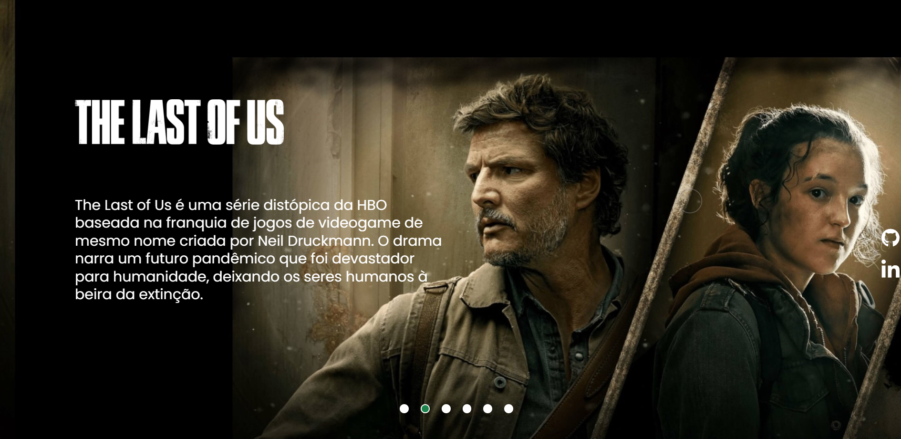

<h1 align="center">Habits</h1>

Pagina Web com inspiração na HBO+

  <a href="#-tecnologias">Tecnologias</a>&nbsp;&nbsp;&nbsp;|&nbsp;&nbsp;&nbsp;
  <a href="#-projeto">Projeto</a>&nbsp;&nbsp;&nbsp;|&nbsp;&nbsp;&nbsp;
  <a href="#-layout">Layout</a>&nbsp;&nbsp;&nbsp;|&nbsp;&nbsp;&nbsp;
  <a href="#memo-licença">Licença</a>

  

 

  

##  Tecnologias

Esse projeto foi desenvolvido com as seguintes tecnologias:

- HTML e CSS
- JavaScript
- Git e Github

## 💻 Projeto

Página Web feita com base na série da HBO+ The Last Of Us

- [Visite o projeto online](https://matheusgrz141.github.io/projeto-the-last-of-us)

## :memo: Licença

Esse projeto está sob a licença MIT.